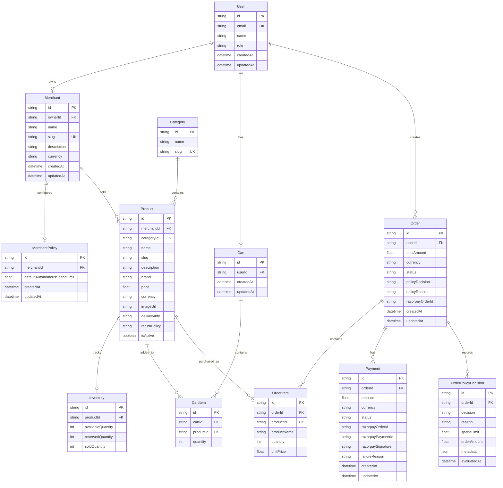

<div align="center">


# IntentFlow

### AI-Native Commerce Orchestration

> **AI proposes. Policy decides. Merchant approves. Razorpay executes.**

IntentFlow is a full-stack, intent-driven commerce platform that transforms natural-language shopping requests into controlled, policy-aware purchasing workflows.

Instead of navigating traditional product catalogs, buyers simply describe what they want. IntentFlow uses AI to understand their intent, discover and semantically rank relevant products, evaluate purchases against autonomous spending policies, route high-value orders for merchant approval, and securely execute approved payments through Razorpay.

**From intent to payment — with AI intelligence, policy control, and merchant oversight built into the flow.**

</div>

---
---

## ✨ Overview

Traditional commerce requires users to manually search, filter, compare, and purchase products.

IntentFlow introduces an **intent-first commerce experience**:

```text
Buyer expresses intent
        ↓
AI extracts shopping requirements
        ↓
Semantic product discovery
        ↓
Products ranked by relevance
        ↓
Buyer adds products to cart
        ↓
Checkout
        ↓
Merchant policy evaluation
        ↓
 ┌───────────────────────────┐
 │ Within autonomous limit   │
 │                           │
 │      AUTO APPROVED        │
 └─────────────┬─────────────┘
               │
               ↓
        Razorpay Checkout


 ┌───────────────────────────┐
 │ Above autonomous limit    │
 │                           │
 │   PENDING APPROVAL        │
 └─────────────┬─────────────┘
               │
               ↓
       Merchant Dashboard
               │
        Approve / Reject
               │
               ↓
       Razorpay Checkout
               │
               ↓
       Payment Verification
               │
               ↓
             PAID
```

---

# 🚀 Core Features

### 🧠 Natural-Language Shopping

Buyers can describe their requirements naturally:

```text
wireless headphones under 5000
```

```text
gaming headset with good microphone under 8000
```

```text
noise cancelling headphones
```

IntentFlow extracts relevant constraints such as:

* Product category
* Minimum price
* Maximum price
* Stock requirements
* Semantic preferences

---

### 🔎 AI-Powered Product Discovery

Products are ranked against the buyer's intent using:

* Semantic relevance
* Category matching
* Availability
* Price constraints
* Product metadata

Each recommendation exposes:

* Relevance score
* Semantic score
* Matched reasons
* Product description
* Brand
* Price
* Delivery information
* Inventory state

---

### 🛒 Cart & Checkout

Authenticated buyers can:

* Add products to cart
* Increase/decrease quantities
* Remove products
* Clear the cart
* Review totals
* Start checkout

Cart operations validate product availability and inventory before modification.

---

### 🛡️ Policy-Governed Commerce

IntentFlow introduces a merchant-controlled autonomous spending limit.

Example:

```text
Merchant autonomous limit: ₹5,000

Order: ₹3,499
        ↓
AUTO_APPROVED
        ↓
Razorpay
```

For a higher-value order:

```text
Merchant autonomous limit: ₹5,000

Order: ₹29,999
        ↓
PENDING_APPROVAL
        ↓
Merchant reviews order
        ↓
APPROVED
        ↓
Razorpay
```

The AI does not independently decide whether a transaction is allowed.

The policy layer controls the transaction.

---

### 🏪 Merchant Governance

Merchants have a dedicated workspace for:

* Storefront configuration
* Autonomous spending policy
* Product catalog
* Inventory
* Order approvals

Merchants can review orders that exceed their autonomous spending limit and:

* Approve the order
* Reject the order
* Review policy reasoning
* View order items and payment state

---

### 💳 Razorpay Payment Integration

Approved orders can be converted into Razorpay payment orders.

Payment flow:

```text
IntentFlow Order
      ↓
Create Razorpay Order
      ↓
Razorpay Checkout
      ↓
Customer Payment
      ↓
Razorpay Signature
      ↓
Backend Verification
      ↓
Payment SUCCESS
      ↓
Order PAID
```

The backend verifies the Razorpay signature using HMAC-SHA256 before marking the payment successful.

---

# 🏗️ Architecture

```text
┌─────────────────────────────────────────────────────────────┐
│                        BUYER UI                             │
│                                                             │
│  Intent Search → Product Results → Cart → Checkout          │
└─────────────────────────────┬───────────────────────────────┘
                              │
                              │ REST API
                              ▼
┌─────────────────────────────────────────────────────────────┐
│                     EXPRESS API                             │
│                                                             │
│  Authentication                                             │
│  Intent Search                                              │
│  Cart Management                                            │
│  Checkout                                                   │
│  Policy Evaluation                                          │
│  Order Management                                           │
│  Merchant Approval                                          │
│  Razorpay Integration                                       │
└───────────────┬──────────────────────┬──────────────────────┘
                │                      │
                ▼                      ▼
       ┌────────────────┐     ┌──────────────────┐
       │ AI Package     │     │ PostgreSQL / DB  │
       │                │     │                  │
       │ Intent parsing │     │ Users            │
       │ Semantic rank  │     │ Merchants        │
       │ Search         │     │ Products         │
       └────────────────┘     │ Inventory        │
                              │ Cart             │
                              │ Orders           │
                              │ Payments         │
                              │ Policy Audits    │
                              └────────┬─────────┘
                                       │
                                       ▼
                              ┌─────────────────┐
                              │    Razorpay     │
                              │                 │
                              │ Payment Gateway │
                              └─────────────────┘
```

---

# 🧰 Tech Stack

| Layer          | Technology                        |
| -------------- | --------------------------------- |
| Frontend       | Next.js 16                        |
| Language       | TypeScript                        |
| UI             | React 19                          |
| Styling        | Tailwind CSS 4                    |
| Backend        | Node.js + Express                 |
| Database       | Prisma ORM                        |
| Database       | Relational SQL database           |
| AI             | Internal `@intentflow/ai` package |
| Shared Types   | `@intentflow/shared`              |
| Payments       | Razorpay                          |
| Authentication | Token-based authentication        |
| Architecture   | npm Workspaces / Monorepo         |

---

# 📁 Project Structure

```text
IntentFlow/
│
├── apps/
│   │
│   ├── api/
│   │   └── src/
│   │       ├── index.ts
│   │       ├── middleware/
│   │       ├── routes/
│   │       │   ├── cart.ts
│   │       │   ├── orders.ts
│   │       │   └── search.ts
│   │       └── services/
│   │           ├── razorpayService.ts
│   │           └── searchService.ts
│   │
│   └── web/
│       └── src/
│           ├── app/
│           │   ├── page.tsx
│           │   ├── login/
│           │   ├── register/
│           │   ├── cart/
│           │   ├── checkout/
│           │   ├── orders/
│           │   └── merchant/
│           │       ├── page.tsx
│           │       ├── products/
│           │       ├── inventory/
│           │       └── orders/
│           │
│           └── lib/
│               └── api.ts
├── packages/
│   │
│   ├── ai/
│   │   └── src/
│   │
│   ├── database/
│   │   └── prisma/
│   │       ├── schema.prisma
│   │       └── migrations/
│   │
│   └── shared/
│       └── src/
│
├── package.json
└── package-lock.json
```

---

# 🗄️ Database Design

IntentFlow uses a normalized relational model separating:

* Identity
* Merchants
* Merchant policies
* Product catalog
* Categories
* Inventory
* Buyer carts
* Orders
* Order items
* Policy decisions
* Payments

This separation keeps commerce state, governance state, and payment state independently auditable.

## Entity Relationship Diagram



---

# 🔐 Order State Machine

Orders move through explicit states rather than directly jumping from checkout to payment.

```text
                    ┌─────────────────┐
                    │     CHECKOUT    │
                    └────────┬────────┘
                             │
                   Policy Evaluation
                             │
              ┌──────────────┴──────────────┐
              │                             │
              ▼                             ▼
       AUTO_APPROVED                 REQUIRES_APPROVAL
              │                             │
              ▼                             ▼
          APPROVED                  PENDING_APPROVAL
              │                             │
              │                    ┌────────┴────────┐
              │                    │                 │
              │                    ▼                 ▼
              │                APPROVED          CANCELLED
              │                    │
              └──────────┬─────────┘
                         │
                         ▼
                 PAYMENT_PENDING
                         │
                Razorpay Checkout
                         │
              ┌──────────┴──────────┐
              │                     │
              ▼                     ▼
             PAID                 FAILED
```

### Order Statuses

| Status             | Meaning                                 |
| ------------------ | --------------------------------------- |
| `PENDING_APPROVAL` | Merchant approval is required           |
| `APPROVED`         | Order passed policy / merchant approval |
| `PAYMENT_PENDING`  | Razorpay payment has been created       |
| `PAID`             | Payment successfully verified           |
| `CANCELLED`        | Order rejected/cancelled                |
| `FAILED`           | Payment/order processing failed         |

---

# 🛡️ Policy Governance

IntentFlow separates **AI recommendation** from **transaction authorization**.

### Policy decision

```text
Order Total <= Merchant Limit
        ↓
AUTO_APPROVED
```

```text
Order Total > Merchant Limit
        ↓
REQUIRES_APPROVAL
        ↓
Merchant Decision
        ↓
APPROVED / REJECTED
```

For example:

```text
Autonomous Spend Limit: ₹5,000

Order Amount: ₹29,999

₹29,999 > ₹5,000

        ↓

PENDING_APPROVAL
```

The decision is persisted in `OrderPolicyDecision`, providing an audit trail containing:

* Decision
* Reason
* Spend limit
* Order amount
* Evaluation timestamp
* Metadata

---

# 🧾 Policy Audit Trail

Every policy evaluation is recorded separately from the order.

Example:

```json
{
  "decision": "REQUIRES_APPROVAL",
  "reason": "Order amount exceeds autonomous spending limit",
  "spendLimit": 5000,
  "orderAmount": 29999,
  "metadata": {
    "cartId": "cart_id",
    "itemCount": 1
  }
}
```

Merchant approval/rejection decisions are also recorded in the policy audit history.

This allows the platform to answer:

> Why was this transaction allowed, blocked, or sent for approval?

---

# 💳 Payment Architecture

Razorpay integration is deliberately split into two backend operations.

## 1. Create Payment

```http
POST /api/orders/:orderId/payment
```

Responsibilities:

1. Authenticate buyer
2. Verify order ownership
3. Ensure order is `APPROVED`
4. Create Razorpay order
5. Create IntentFlow `Payment`
6. Set order to `PAYMENT_PENDING`

---

## 2. Verify Payment

```http
POST /api/orders/:orderId/payment/verify
```

Responsibilities:

1. Validate Razorpay identifiers
2. Verify IntentFlow order
3. Verify Razorpay order ID
4. Generate expected HMAC-SHA256 signature
5. Compare signatures using timing-safe comparison
6. Mark payment `SUCCESS`
7. Mark order `PAID`

Signature:

```text
HMAC-SHA256(
    razorpay_order_id + "|" + razorpay_payment_id,
    RAZORPAY_KEY_SECRET
)
```

The Razorpay secret is never exposed to the browser.

---

# 🌐 API Overview

## Authentication

| Method | Endpoint             | Description               |
| ------ | -------------------- | ------------------------- |
| `POST` | `/api/auth/register` | Register a buyer/merchant |
| `POST` | `/api/auth/login`    | Authenticate user         |

---

## Search

| Method | Endpoint             | Description                                      |
| ------ | -------------------- | ------------------------------------------------ |
| `POST` | `/api/search/intent` | Parse shopping intent and return ranked products |

Example:

```json
{
  "message": "wireless headphones under 5000"
}
```

---

## Cart

| Method   | Endpoint                  | Description                   |
| -------- | ------------------------- | ----------------------------- |
| `GET`    | `/api/cart`               | Get authenticated user's cart |
| `POST`   | `/api/cart/items`         | Add product to cart           |
| `PATCH`  | `/api/cart/items/:itemId` | Update cart quantity          |
| `DELETE` | `/api/cart/items/:itemId` | Remove cart item              |
| `DELETE` | `/api/cart`               | Clear cart                    |

---

## Orders

| Method | Endpoint                       | Description                                        |
| ------ | ------------------------------ | -------------------------------------------------- |
| `POST` | `/api/orders/checkout`         | Convert cart into order and evaluate policy        |
| `GET`  | `/api/orders`                  | Get buyer's orders                                 |
| `GET`  | `/api/orders/:orderId`         | Get a specific buyer order                         |
| `GET`  | `/api/orders/merchant`         | Get orders associated with merchant-owned products |
| `POST` | `/api/orders/:orderId/approve` | Merchant approves pending order                    |
| `POST` | `/api/orders/:orderId/reject`  | Merchant rejects pending order                     |

---

## Payments

| Method | Endpoint                              | Description                       |
| ------ | ------------------------------------- | --------------------------------- |
| `POST` | `/api/orders/:orderId/payment`        | Create Razorpay payment order     |
| `POST` | `/api/orders/:orderId/payment/verify` | Verify Razorpay payment signature |

---

# 👤 Buyer Experience

The buyer application provides:

### Home

```text
IntentFlow
    ↓
Natural-language search
    ↓
AI recommendations
```

### Product Discovery

Each product displays:

* Ranking
* Match percentage
* Brand
* Price
* Description
* Matching reasons
* Delivery information
* Add to Cart

### Cart

```text
Product
  ↓
Quantity
  ↓
Cart Total
  ↓
Checkout
```

### Checkout

The checkout screen explains the policy state before payment.

For an approval-required order:

```text
Order Amount: ₹29,999

Autonomous Limit: ₹5,000

Status:
PENDING APPROVAL

Merchant approval is required before payment.
```

After approval:

```text
Status:
APPROVED

Your order is ready for Razorpay payment.
```

---
### Order History

Buyers can access `/orders` to view their complete order history and track the current state of every order.

The order history displays:

* Order status
* Order date
* Product name
* Quantity
* Unit price
* Order total
* Payment state
* Payment / resume-payment action when applicable

Supported order states include:

```text
PENDING_APPROVAL
APPROVED
PAYMENT_PENDING
PAID
CANCELLED
FAILED

# 🏪 Merchant Experience

Merchant workspace:

```text
Merchant Workspace
│
├── Overview & Policy
│
├── Product Catalog
│
├── Inventory Management
│
└── Order Approvals
```

The Order Approvals dashboard provides:

* Pending approval count
* Approved count
* Total order count
* Order amount
* Buyer/order information
* Policy reason
* Approve action
* Reject action

---

# 🔑 Authentication & Sessions

The frontend stores the authenticated session locally.

Stored values:

```text
intentflow_auth_token
intentflow_auth_user
```

API requests automatically attach:

```http
Authorization: Bearer <token>
```

Authentication is enforced on:

* Cart
* Checkout
* Orders
* Payment
* Merchant approval operations

---

# ⚙️ Environment Variables

## Frontend

Create:

```text
apps/web/.env.local
```

```env
NEXT_PUBLIC_API_URL=http://localhost:4000
```

---

## Backend

Create:

```text
apps/api/.env
```

Configure the API/database variables required by your local environment, including Razorpay credentials:

```env
RAZORPAY_KEY_ID=your_test_key_id
RAZORPAY_KEY_SECRET=your_test_key_secret
```

> Never commit real Razorpay secrets or `.env` files to GitHub.

---

# 🚀 Local Development

## 1. Install dependencies

From the repository root:

```powershell
npm install
```

---

## 2. Configure environment variables

Frontend:

```text
apps/web/.env.local
```

Backend:

```text
apps/api/.env
```

---

## 3. Generate / update Prisma client

Use the repository's Prisma commands configured for your workspace.

---

## 4. Start the API

From the repository root, use the configured workspace development command for `@intentflow/api`.

The API runs on:

```text
http://localhost:4000
```

---

## 5. Start the frontend

Use:

```powershell
npm run dev
```

The frontend runs on:

```text
http://localhost:3000
```

---

# 🧪 Validation

Before committing changes, run:

```powershell
npm run typecheck
```

The project currently typechecks across:

```text
@intentflow/api
@intentflow/web
@intentflow/ai
@intentflow/database
@intentflow/shared
```

Run the production build with:

```powershell
npm run build
```

The Next.js application should generate these routes:

```text
/
/
 /login
 /register
 /cart
 /checkout
 /orders
 /merchant
 /merchant/products
 /merchant/products/new
 /merchant/products/[id]
 /merchant/inventory
 /merchant/orders
```

---

# 🧪 End-to-End Demo

## Scenario A — Autonomous Purchase

Use a product/order below the merchant's autonomous limit.

```text
Buyer
 ↓
Search
 ↓
Add to Cart
 ↓
Checkout
 ↓
Policy
 ↓
AUTO_APPROVED
 ↓
Pay with Razorpay
 ↓
Verify Signature
 ↓
PAID
```

---

## Scenario B — Merchant Approval

Use an order above the autonomous spending limit.

Example:

```text
Autonomous limit: ₹5,000
Order: ₹29,999
```

Flow:

```text
Buyer
 ↓
Search
 ↓
Add to Cart
 ↓
Checkout
 ↓
PENDING_APPROVAL
 ↓
Merchant Dashboard
 ↓
Approve
 ↓
Buyer Checkout
 ↓
Pay with Razorpay
 ↓
Signature Verification
 ↓
PAID
```

---

# 🔒 Security Principles

IntentFlow follows several important security boundaries:

### Razorpay Secret

The Razorpay secret is kept exclusively on the backend.

### Payment Verification

Payment success is not trusted from the frontend alone.

The backend verifies:

```text
razorpay_order_id
razorpay_payment_id
razorpay_signature
```

before updating the database.

### Merchant Authorization

Merchant approval routes require:

```text
Authentication
        +
MERCHANT role
        +
Ownership of the relevant product/order
```

### Policy Enforcement

The AI search layer can recommend products, but transaction authorization is handled by the policy layer.

---

# 📊 Why the Database Is Structured This Way

IntentFlow intentionally separates commerce entities instead of storing everything inside an order record.

### Product

Represents the merchant's current catalog information.

### Inventory

Represents stock state independently from product metadata.

### Cart / CartItem

Represents temporary buyer intent before checkout.

### Order / OrderItem

Represents the immutable commercial transaction snapshot.

`OrderItem` stores:

```text
productName
unitPrice
quantity
```

so historical orders remain understandable even if the product catalog changes later.

### OrderPolicyDecision

Represents the governance/audit layer.

### Payment

Represents the payment gateway lifecycle independently from the order lifecycle.

This separation makes the system easier to audit, extend, and reason about.

---

# 🧠 Design Philosophy

IntentFlow is built around four layers:

```text
┌──────────────────────────────┐
│           INTENT             │
│                              │
│ What does the buyer want?    │
└──────────────┬───────────────┘
               ↓
┌──────────────────────────────┐
│          DISCOVERY           │
│                              │
│ Which products match?        │
└──────────────┬───────────────┘
               ↓
┌──────────────────────────────┐
│           POLICY             │
│                              │
│ Is the transaction allowed?  │
└──────────────┬───────────────┘
               ↓
┌──────────────────────────────┐
│          EXECUTION           │
│                              │
│ Execute verified payment.    │
└──────────────────────────────┘
```

The key architectural principle is:

> **AI can propose. Policy must decide. Payment must be verified.**

---

# 🗺️ Roadmap

### Completed

* [x] Natural-language product search
* [x] AI intent extraction
* [x] Semantic product ranking
* [x] Buyer authentication
* [x] Merchant authentication
* [x] Product catalog
* [x] Inventory management
* [x] Inventory reservation and stock lifecycle
* [x] Cart management
* [x] Cart / order separation
* [x] Checkout flow
* [x] Autonomous spending policy
* [x] Policy audit records
* [x] Merchant approval / rejection workflow
* [x] Buyer order history
* [x] Merchant order dashboard
* [x] Role-aware buyer / merchant navigation
* [x] Order state machine
* [x] Payment state management
* [x] Razorpay order creation
* [x] Razorpay Checkout integration
* [x] Razorpay payment resume / idempotency
* [x] Razorpay signature verification
* [x] Concurrent checkout protection
* [x] Inventory concurrency protection
* [x] Approve / reject race-condition protection
* [x] Order ownership and merchant authorization
* [x] Hydration-safe authentication state
* [x] Configurable CORS
* [x] Environment-based API configuration
* [x] Removal of machine-specific paths
* [x] Server-side Razorpay secret protection
* [x] TypeScript validation
* [x] Production build validation
* [x] Deployment-readiness audit

### Next

* [ ] Production deployment
* [ ] Automated end-to-end / integration tests
* [ ] Payment failure and retry UX
* [ ] Real-time merchant approval updates
* [ ] Advanced order history and order-detail UI
* [ ] Product image management
* [ ] Advanced merchant analytics
* [ ] Observability and audit dashboards
* [ ] Email / webhook notifications
* [ ] Mobile-friendly merchant navigation

---

> **Current milestone:** Core end-to-end commerce orchestration is complete and validated locally.
>
> **Next focus:** Production deployment, automated testing, observability, and experience improvements.

# 🎯 Project Status

IntentFlow currently provides a functional end-to-end commerce orchestration demo:

```text
Natural Language
      ↓
AI Intent
      ↓
Semantic Discovery
      ↓
Cart
      ↓
Policy Evaluation
      ↓
Merchant Governance
      ↓
Razorpay
      ↓
Signature Verification
      ↓
PAID
```

The system demonstrates how **agentic commerce can remain governed and auditable while still providing a highly autonomous shopping experience.**

---

## License

This project is intended as a software engineering / portfolio project.
